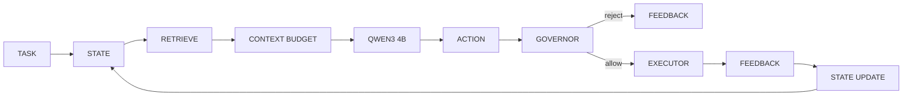

<p align="center">
  
</p>

# SCAFFOLD

**An experimental execution and context-management runtime for small reasoning models.** This research focuses specifically on improving the **effective reliability** of `qwen3:4b-instruct` under a tight 4096-token context window.

> **Status: RESEARCH FREEZE COMPLETE** — the research program is frozen. This repository is a preserved research artifact, not an actively developed product.

---

## What Is SCAFFOLD?

SCAFFOLD is a lightweight, deterministic execution and context-management layer that sits **between** a reasoning model and a workspace. It does **not** modify the model. It provides structure around the model: deterministic state tracking, formatted feedback, semantic retrieval, action governance, and execution control.

- **qwen3:4b-instruct** — reasoning and action selection only
- **all-minilm:latest** — semantic embedding and retrieval only
- **SCAFFOLD** — deterministic state, feedback, retrieval, governor, and execution management

## The Research Question

> **Can deterministic software infrastructure compensate for the specific reasoning/reliability deficits of a small model — without changing the underlying model?**

SCAFFOLD treats the model as fixed and asks whether careful, deterministic management of the execution loop (state, feedback, retrieval, and action execution) can make a small model *reliably usable* for structured tasks, even if the model's intrinsic capability is unchanged.

## Architecture

```
TASK → STATE → RETRIEVE → CONTEXT BUDGET → QWEN3 4B → ACTION
      → GOVERNOR → EXECUTOR → FEEDBACK → STATE UPDATE → NEXT DECISION
```



The frozen pipeline: `TASK → STATE → RETRIEVE → CONTEXT BUDGET → QWEN3 4B → ACTION → GOVERNOR → EXECUTOR → FEEDBACK → STATE UPDATE → NEXT DECISION`.

See **[`FINAL-ARCHITECTURE.md`](./FINAL-ARCHITECTURE.md)** for the consolidated canonical pipeline and the full mechanism classification.

## Mechanisms

All mechanisms are **runtime infrastructure around the model** — none modify the model's weights; none change its intrinsic reasoning capability.

| Mechanism | Role | Classification |
|---|---|---|
| **MODEL** | `qwen3:4b-instruct`, fixed prompt contract, action-selection only | External reasoning model |
| **STATE** | Execution memory (task, goals, files, progress, history) formatted into context | Deterministic runtime |
| **FEEDBACK** | Structured format of execution/governor results fed back to the model | Deterministic runtime |
| **RETRIEVAL** | Semantic content selection (embed → cosine rank → top-K) with budgeted admission | Deterministic runtime |
| **GOVERNOR** | Deterministic guard-rails (duplicate, noop-limit, failed-replay prevention) | Deterministic runtime |
| **EXECUTOR** | Deterministic file/command action execution | Deterministic runtime |

## Frozen Model Configuration

The configuration is fixed and measured only with these models:

| Role | Model |
|---|---|
| Reasoning | `qwen3:4b-instruct` |
| Embedding / retrieval | `all-minilm:latest` |

- **Context window:** 4096 tokens (3840 input / 256 reserved output)
- **Temperature:** 0.1
- **Max actions per task:** 20

No other models are claimed to be supported.

## Research Findings

All figures below are taken verbatim from the phase reports and consolidated in **[`benchmarks/FINAL-EVIDENCE.md`](./benchmarks/FINAL-EVIDENCE.md)**. Across **4200 executions** (Phases 1-8):

### Experimentally supported
- The full SCAFFOLD stack raises `qwen3:4b-instruct` task completion from a ~10% raw-model baseline to the ~46-50% range (Phases 1-4, repeated).
- **FEEDBACK** is independently effective on its own (Phase 3: +20pp; Phase 4: FEEDBACK_ONLY 30%).
- **RETRIEVAL** is independently effective on its own (Phase 3: +20pp; Phase 4: +10pp).
- **STATE** is the decisive increment **within the full stack** (Phase 5 causal trace: only STATE differs between the near-full and full configurations; binding hard tasks flip).
- `RETRIEVAL_75` (a 75% retrieval-admission budget) is Pareto-superior to FULL on completion, calls, tokens, and latency (Phase 6) with zero regressions.

### Partially supported
- FULL vs RETRIEVAL_75 parity (Phase 7, n≈200 per arm): no statistically significant completion difference (McNemar p = 1.0; CI [-1.7%, +2.7%]); RETRIEVAL_75 remains the recommended lean default.

### Not supported
- STATE **alone** or GOVERNOR **alone** improving completion (Phase 3).
- Compressing STATE/FEEDBACK to save cost without loss (Phase 6).
- Aggressive retrieval reduction (`RETRIEVAL_MIN`) — degrades hard tasks (Phase 6).
- **Adaptive retrieval** (Phase 8): no file exceeds the base slice, so adaptive policies never trigger and ship byte-identical payloads to RETRIEVAL_75 (NOT SUPPORTED).
- "Increased intrinsic reasoning", "generalization to arbitrary small models".

## Final Conclusion

> SCAFFOLD demonstrates experiment-supported, model-specific improvements in the **effective reliability** of `qwen3:4b-instruct` through deterministic management of **state, feedback, retrieval, and action execution**.

It does **not** demonstrate:
- increased intrinsic model reasoning capability
- general reasoning improvement for arbitrary models
- universal improvement across small language models

See [`LIMITATIONS.md`](./LIMITATIONS.md) for the full boundaries.

## Research Phases

| Phase | Focus |
|---|---|
| **1** | Baseline stack evaluation (MODEL_ONLY / MINIMAL / RETRIEVAL / FULL) |
| **2** | Replication / infrastructure correction |
| **3** | Causal mechanism ablation |
| **4** | Efficiency / minimal-stack investigation |
| **5** | Causal trace analysis — why does the full stack work |
| **6** | Compression experiments (RETRIEVAL_75) |
| **7** | Robustness validation (retrieval-deployment parity) |
| **8** | Adaptive retrieval parity test (negative) |
| **9** | Final audit / research freeze |

See [`PROGRESS.md`](./PROGRESS.md) and the `benchmarks/PHASE*-REPORT.md` files for details.

## Repository Structure

```
.
├── src/                    # Frozen implementation
│   ├── model/              # Qwen3 + MiniLM adapters
│   ├── cognition/          # Action parsing / validation
│   ├── state/              # Task state representation
│   ├── context/            # Token budget + context selection
│   ├── feedback/           # Feedback formatting
│   ├── execution/          # System prompt, formatters, governor, executor, loop
│   ├── retrieval/          # Similarity, cache, retriever, adaptive budget
│   └── benchmark/          # Task definitions (30) + runner
├── benchmarks/             # Phase runners, reports, and research results
│   ├── FINAL-EVIDENCE.md   # Consolidated evidence table
│   ├── PHASE*-REPORT.md    # Phase 1-9 research reports
│   └── results/            # Research evidence (results.json, checkpoint.json, analyses)
├── tests/                  # Vitest unit/regression suite
├── scripts/                # Phase entrypoints + report writers
├── assets/                 # Logo
├── ARCHITECTURE.md         # Reference implementation docs
├── FINAL-ARCHITECTURE.md   # Frozen canonical architecture
├── LIMITATIONS.md          # Boundaries of the claims
├── REPRODUCIBILITY.md      # Reproduction guidance
└── PROGRESS.md             # Phase tracker + research freeze
```

## Installation / Development

Requires **Node.js** and a running **Ollama** with the frozen models (`qwen3:4b-instruct`, `all-minilm:latest`).

```bash
npm install
npm run build        # compile TypeScript (tsc)
npm run typecheck    # type-check without emitting (tsc --noEmit)
```

## Testing

```bash
npm test             # vitest run (11 files / 175 tests)
npm run test:watch   # vitest watch mode
npm run test:coverage
```

## Benchmarking

> **The research is frozen. Benchmarks are preserved research evidence, not an ongoing product benchmark.**

Phase runners exist for historical reproduction (`npm run phase1` … `phase8`; requires Ollama). Results are tracked in `benchmarks/results/` and documented in the phase reports. Do **not** treat these as a live product benchmark, and do **not** run experiments against the frozen record.

## Reproducibility

See **[`REPRODUCIBILITY.md`](./REPRODUCIBILITY.md)** for the frozen environment, reproduction commands, and known reproducibility boundaries. Do **not** cite old-model results from the historical v1 archive as evidence for this system.

## Limitations

See **[`LIMITATIONS.md`](./LIMITATIONS.md)**. In short: results are single-model, single-hardware, single-benchmark; small deltas are within noise; no universal-improvement or general-small-model claim is made.

## Research Status

**SCAFFOLD RESEARCH FREEZE COMPLETE**

The research program is frozen as of 2026-08-28. No new cognitive mechanisms, benchmarks, models, or further phases are planned. Historical artifacts (Phases 0-9 and the v1 archive) are immutable.

## License

No license is provided. This is a private research project and is not licensed for distribution.
